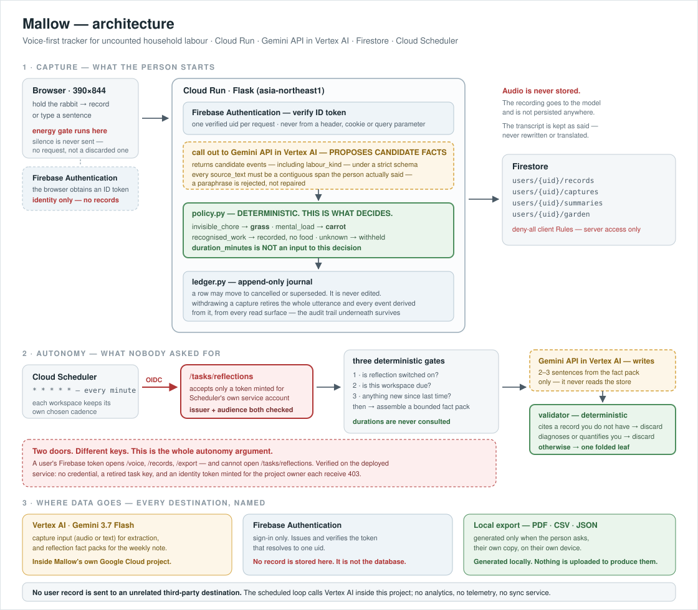
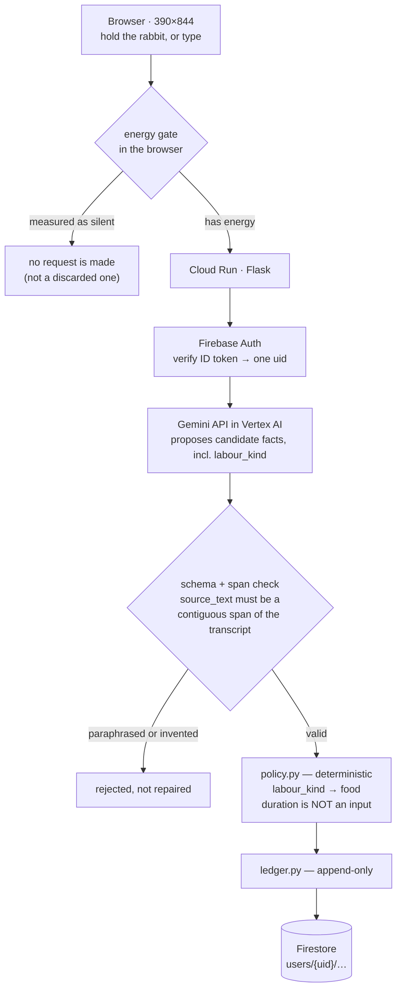
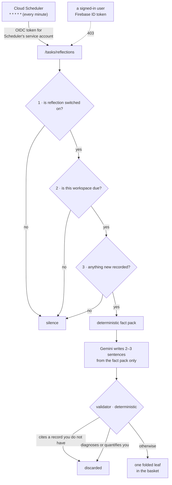

# Architecture



The diagram above is the authoritative one. This page says the same thing in
words, and names the file where each claim is enforced.

---

## Capture — the path a sentence takes



| Step | Where it lives | The point |
|---|---|---|
| Energy gate | `mobile/templates/index.html` | Runs on the samples, in the browser. Silence produces **no request**, rather than a request whose answer is thrown away. It is an energy gate and is described as one — it cannot tell speech from a door closing. |
| Identity | `mobile/identity.py` | The uid comes out of a signature checked against Google's public keys. Never from a parameter, header or unsigned cookie. |
| Extraction | `spike/voice/gemini.py`, `contract.py` | One model call, one strict schema. `PROMPT_VERSION` is pinned in the source. |
| Span rule | `spike/voice/contract.py` | `source_text` must be a contiguous span the person actually said. A model cannot paraphrase, translate or invent words attributed to someone. |
| Decision | `spike/voice/policy.py` | Deterministic, and the whole of it: `invisible_chore→grass`, `mental_load→carrot`, `recognised_work→recorded, no food`, anything else→`withheld`. 🔴 **`duration_minutes` is not an input.** The model classifies; the policy maps; duration is recorded, never consulted. |
| Journal | `mobile/ledger.py` | Append-only. Rows move to `cancelled` or `superseded`; nothing is edited in place. |
| Store | `mobile/firestore_store.py`, `workspaces.py` | One workspace per uid, transactional per capture. Client SDK access is denied by the versioned Rules file — the server is the only way in. |

**Why the decision is not the model's.** The product's claim is that it files
your words honestly. A model that could choose the reward could also be
persuaded — by a phrasing, by a long day, by a future prompt edit — to file
cooking as invisible labour. The classification comes from the model; the
consequence comes from Python.

---

## Autonomy — the path nobody starts



**Enforced in** `mobile/tasks.py` (the door), `mobile/reflection_schedule.py`
(cadence and due-time), `mobile/reflection.py` (gates, fact pack, validation).

Three properties are worth stating plainly, because they are what make this an
agent rather than a feature:

1. **Nobody can ask for a leaf.** There is no button, no query parameter, no
   developer route in the running app. `./run.sh leaf` exists in the repository
   as a developer command and is not reachable from the deployed service.
2. **It usually decides to say nothing.** Each of the three gates is a reason to
   stay quiet. Silence is the normal outcome and is not reported as a failure.
3. **A bad note is discarded, not repaired.** The validator has no fixer. A note
   that cites a record you do not have is either a hallucination or somebody
   else's data, and both mean the same thing: do not write it.

---

## The two doors

| | Opened by | Reaches |
|---|---|---|
| **User door** | Firebase ID token, verified per request | `/voice` `/voice/text` `/voice/discard` `/records` `/export*` `/settings/*` |
| **Scheduler door** | OIDC token minted for Cloud Scheduler's own service account, issuer **and** audience checked | `/tasks/reflections` only |

Tested against the deployed service, not asserted: no credential, a retired
local task key, and a real Google identity token minted for the **project
owner** each receive `403`.

The two service accounts hold only what they need — the app's own
`aiplatform.user` and `datastore.user`, and nothing else.

---

## Data boundaries

| | |
|---|---|
| **Audio** | Sent to the model, never persisted. |
| **Transcript** | Stored as said. Never rewritten, translated or paraphrased by Mallow. |
| **Withdrawal** | Retires the whole utterance and every derived event from every read surface — records, rollup, reflection fact pack, CSV, JSON, PDF — while the append-only audit state underneath is preserved. |
| **Destinations** | Two, both named: **Vertex AI** — capture input and reflection fact packs, inside Mallow's own Google Cloud project; **Firebase Authentication** — identity only, never a record. |
| **Not destinations** | No analytics, no telemetry, no sync service, no unrelated third party. PDF, CSV and JSON are generated locally and never sent anywhere. |
| **No automatic outbound path** | Nothing is sent on the product's own initiative. `test_no_automatic_outbound_path` asserts the server's source contains no mail or generic HTTP-post machinery. This is a narrower claim than "nothing leaves", and it is the true one. |
| **Service worker** | Navigation is network-first; private routes are never cached; a capture is never cached. |

---

## Deployment shape

```
Cloud Run  mallow  ·  asia-northeast1  ·  512Mi · 1 cpu · max 3 instances
           gunicorn, 1 worker, 8 threads   (the work per request is one
                                            upstream model call)
Firestore  asia-northeast1, deny-all client Rules from deploy/firestore.rules
Scheduler  mallow-reflections  * * * * *  (every minute) → OIDC → /tasks/reflections
Model      Gemini API in Vertex AI (Gemini 3.7 Flash) · Google Gen AI SDK · GEMINI_LOCATION=global
```

`GEMINI_LOCATION` is deliberately a separate variable from the Cloud Run region:
the model is not served in `asia-northeast1`, and a shared variable plus a silent
fallback would have looked healthy while never calling the model at all.

Health check is **`/health`**. On Cloud Run, `/healthz` never reaches the
container — Google's frontend answers that exact path with its own 404 before
the request is proxied, with nothing in the service log. Both paths are
registered; only one of them works there.
